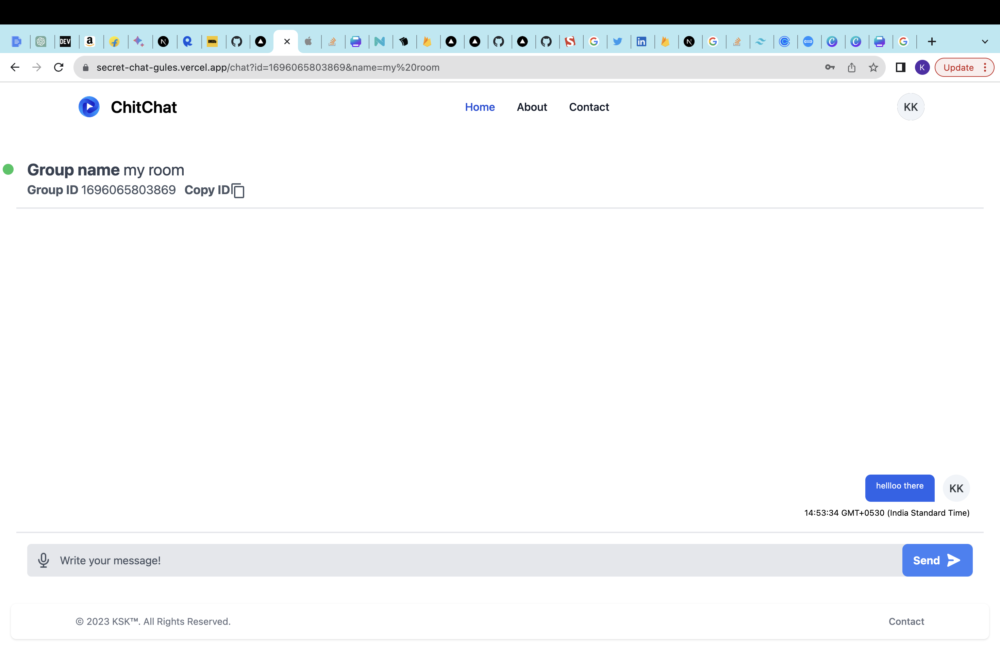
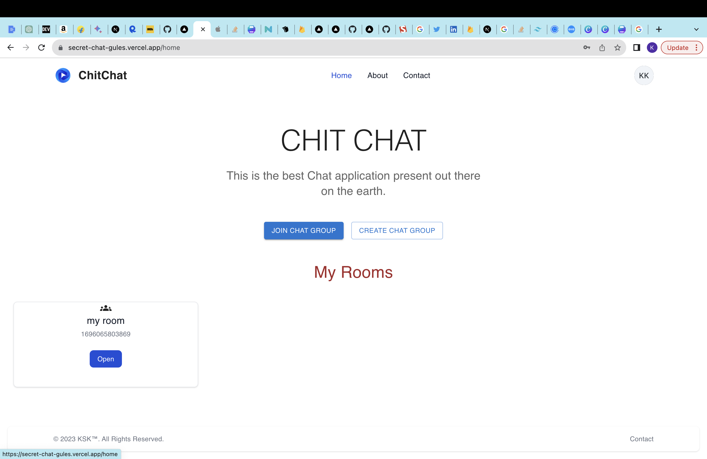

### Hello Hacktober fest peoples Please Move to Feature Request Tab 

# Demo URL https://secret-chat-gules.vercel.app/

### Set Up

## Mongo DB URI 

Add Your mongo db URI to .env.local

## Firebase 

Add your firebase Creds to lib/firebase file

## Getting Started

First, run the development server:

```bash
npm run dev
# or
yarn dev
# or
pnpm dev
```
# Contribution

### By Submiting the PR for Below Feature Request.
### By Identifing the issue and raising them and adding appropriate tags.
### By Adding the Documention


## Features Request

- [x] Add My Chats feature
- [x] Add Logout Feature
- [ ] Add Friend and show Added friend List Feature
- [ ] Remove Login and Registration Dependency from Mongo by Implementing Firebase Auth(Google , Facebook etc)
- [ ] Remove Join Room and Create Room dependency from Mongo by Implementing if by firebase firestore
- [ ] Loader issues while page is Loading or routing from one page to other
- [ ] My Profile feature (Where is can see the Name , username , friends(after we have implemented the Add friend Feature))


# Note: Any Improvement or any bug Fixes are most welcomed

## Live Demo : 

https://secret-chat-gules.vercel.app/

## ScreenShots






Open [http://localhost:3000](http://localhost:3000) with your browser to see the result.

